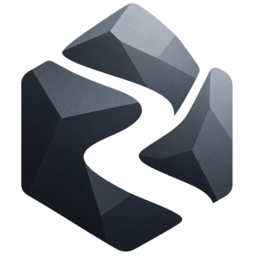

<div align="center">
  

  # StoneIntelligence

  **Gemeinsam denken. In Obsidian schreiben. Überall weiterarbeiten.**

  Live synchronisierte Notizen, gemeinsame Vaults und klare Zugriffsrechte —
  mit einem Arbeitsplatz im Browser und einem Plugin für Obsidian.

  [Dashboard](https://kb.tstieh.de) · [Obsidian einrichten](https://kb.tstieh.de/setup) · [Plugin-Releases](https://github.com/Raindancer118/stoneintelligence/releases) · [Architektur](Plan.md)

  [](https://github.com/Raindancer118/stoneintelligence/actions/workflows/ci.yml)
  [](https://github.com/Raindancer118/stoneintelligence/releases)
</div>

---

StoneIntelligence verbindet einen Obsidian-Vault mit einem gemeinsamen Server. Änderungen an
geöffneten Notizen erscheinen live bei anderen; der restliche Vault wird im Hintergrund
abgeglichen. Im Browser lassen sich Notizen lesen und bearbeiten sowie Mitglieder und Rechte
verwalten.

| In Obsidian | Im Browser | Im Team |
| :--- | :--- | :--- |
| Live-Bearbeitung mit sichtbaren Cursorn | Notizen lesen, bearbeiten und organisieren | Vaults, Einladungen und Mitglieder verwalten |
| Hintergrundabgleich für Notizen und Ordner | Änderungen speichern und Konflikte erkennen | Rollen und Pfadrechte vergeben |
| Offline weiterarbeiten und später abgleichen | Plugin direkt aus dem Vault heraus verbinden | Änderungen im Audit nachvollziehen |

> **Projektstand:** Sync, Dashboard und Rechteverwaltung sind nutzbar. Die KI-Ingestion wird
> derzeit entwickelt; Worker und MCP-Adapter sind noch keine fertigen, produktiv betriebenen
> Funktionen. Die geplanten Bausteine stehen in [Plan.md](Plan.md).

## In Obsidian starten

1. [Obsidian installieren](https://obsidian.md/download) und einen Vault öffnen. Für einen
   gemeinsamen Vault empfiehlt sich ein neuer, leerer Obsidian-Vault: Inhalte eines bestehenden
   Vaults werden beim Verbinden mit den anderen Mitgliedern geteilt.
2. Die [Einrichtungsseite](https://kb.tstieh.de/setup) öffnen. Sie führt durch die Installation
   von [BRAT](https://github.com/TfTHacker/obsidian42-brat) und des StoneIntelligence-Plugins.
3. Im [Dashboard](https://kb.tstieh.de) anmelden, einen Vault anlegen oder eine Einladung
   annehmen und im Vault den Reiter **„In Obsidian“** öffnen. Dort verbindet ein Klick den
   Obsidian-Vault.

Das Plugin ist auf die gehostete Instanz voreingestellt. Für einen eigenen Server lassen sich
API-Adresse und OIDC-Anmeldung unter **Einstellungen → StoneIntelligence → Erweitert** ändern.
Obsidian **1.6.6 oder neuer** wird benötigt; das Plugin läuft auch auf Mobilgeräten.

Wer BRAT manuell einrichtet, trägt dort `Raindancer118/stoneintelligence` als Plugin-Repository
ein. Die [GitHub-Releases](https://github.com/Raindancer118/stoneintelligence/releases) enthalten
`manifest.json`, `main.js` und `styles.css` für eine manuelle Installation unter
`.obsidian/plugins/stoneintelligence/`.

## Für die Entwicklung

Das Repository enthält eine Java-API, ein Obsidian-Plugin und eine Svelte-Webapp. Für die
Java-Module werden **JDK 25** und Maven (`./mvnw`) benötigt, für Plugin und Webapp **Node.js 22**.
Integrationstests verwenden PostgreSQL über Testcontainers und brauchen Docker.

```bash
# Java: Unit- und Integrationstests
./mvnw verify

# Obsidian-Plugin: Tests und Bundle
cd plugin
npm ci
npm test
npm run build

# Webapp: siehe webapp/README.md für die lokale Konfiguration
cd ../webapp
npm ci
npm run check
npm test
npm run dev
```

Für lokale Builds der Java-Module werden die privaten Maven-Abhängigkeiten aus
`packages.tstieh.de` benötigt. Der CI-Workflow zeigt die dafür verwendete Maven-Konfiguration.

Der mitgelieferte [`docker-compose.yml`](docker-compose.yml) definiert PostgreSQL, API, Worker
und MCP-Adapter. Für eine eigene API-Instanz sind mindestens ein Datenbankpasswort und ein
passender OIDC-Issuer nötig. Der Worker und der MCP-Adapter befinden sich noch im Aufbau; für
die aktuelle Sync-Anwendung reichen PostgreSQL und `platform-api`. Die Browser-App benötigt
zusätzlich einen passenden OIDC-Client und eine erlaubte Origin in der API-Konfiguration.

## Was wo liegt

| Pfad | Aufgabe |
| :--- | :--- |
| [`platform-api/`](platform-api/) | REST-API, Yjs-Relay, Rechte, Audit und persistierte Notizen |
| [`plugin/`](plugin/) | Obsidian-Plugin für Live- und Hintergrund-Sync |
| [`webapp/`](webapp/) | Dashboard, Notizeditor und Verwaltung |
| [`domain-core/`](domain-core/) | Gemeinsame Domänenregeln ohne Framework-Abhängigkeit |
| [`stoneai-core/`](stoneai-core/), [`intelligence-worker/`](intelligence-worker/) | KI-Ingestion im Aufbau |
| [`mcp-adapter/`](mcp-adapter/) | Geplanter Agent-Zugang |
| [`docs/adr/`](docs/adr/) | Architekturentscheidungen |

Die vollständigen Ziele und Architekturentscheidungen stehen in [Anforderungen.md](Anforderungen.md)
und [Plan.md](Plan.md). Die Webapp hat eine eigene [Entwickleranleitung](webapp/README.md).

## Lizenz

© 2026 Raindancer118. Alle Rechte vorbehalten. Offizielle Releases dürfen privat und
nichtkommerziell genutzt werden. Für geschäftliche Nutzung oder andere Verwendungen ist eine
ausdrückliche individuelle Erlaubnis erforderlich. Die Einzelheiten stehen in der
[Lizenzdatei](LICENSE.md).
