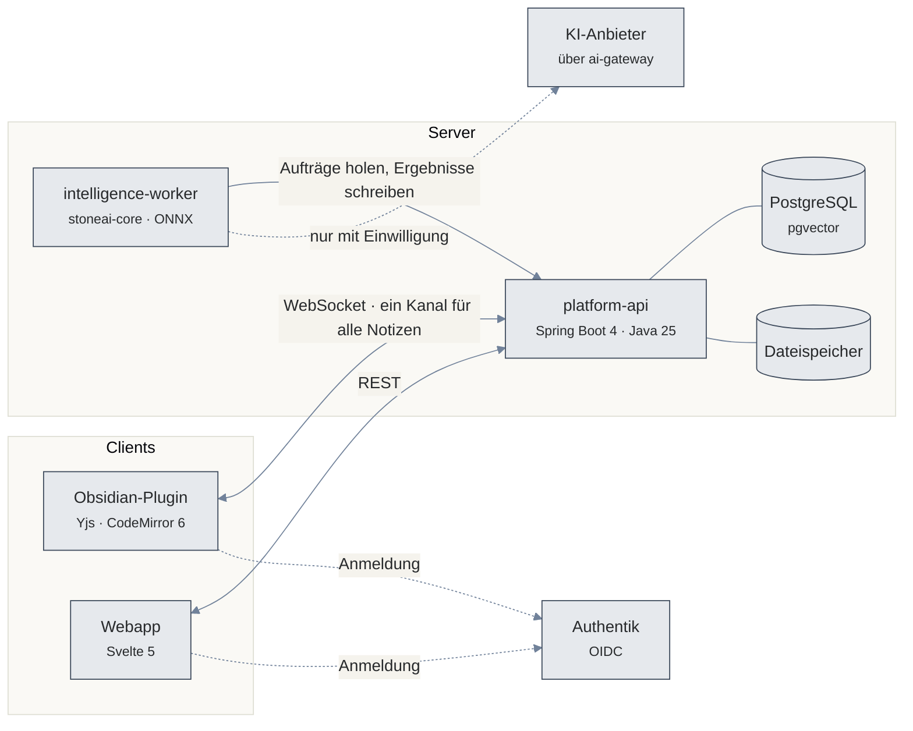

<div align="center">

<a href="https://kb.tstieh.de">
  <picture>
    <source media="(prefers-color-scheme: dark)" srcset="docs/readme/hero-dark.svg">
    
  </picture>
</a>

<br>

[](https://github.com/Raindancer118/stoneintelligence/actions/workflows/ci.yml)
[](https://github.com/Raindancer118/stoneintelligence/releases)
[](https://obsidian.md)
[](platform-api/)

**[Dashboard öffnen](https://kb.tstieh.de)** &nbsp;·&nbsp; **[Obsidian einrichten](https://kb.tstieh.de/setup)** &nbsp;·&nbsp; [Releases](https://github.com/Raindancer118/stoneintelligence/releases) &nbsp;·&nbsp; [Architektur](Plan.md)

</div>

<br>

Obsidian ist wunderbar, solange man allein schreibt. StoneIntelligence macht aus einem Vault einen
gemeinsamen Ort: Wer eine Notiz öffnet, sieht die Cursor der anderen und ihre Änderungen in dem
Moment, in dem sie tippen. Der Rest des Vaults gleicht sich im Hintergrund ab, auch nach Tagen
offline. Wer was lesen darf, entscheidet ihr bis hinunter zur einzelnen Notiz. Und nichts, was einmal
geschrieben war, ist verloren.

Dazu gibt es einen Arbeitsplatz im Browser für alle, die gerade kein Obsidian zur Hand haben, und eine
KI, die Vorlesungsfolien, Verträge oder Protokolle in verlinkte Notizen verwandelt, ohne dass sie dir
dabei das letzte Wort nimmt.

<br>

<table>
<tr>
<td width="56%">
<picture>
  <source media="(prefers-color-scheme: dark)" srcset="docs/readme/versions-dark.svg">
  
</picture>
</td>
<td width="44%">

### Jede Fassung bleibt

Der Server bewahrt jede Änderung auf. Daraus entstehen Versionen, eine je Person und Sitzung. Du
siehst Zeile für Zeile, was eine alte Fassung anders macht, und holst sie mit einem Klick zurück.

Das Zurückholen ist selbst eine neue Änderung: Was dazwischen geschrieben wurde, bleibt als Version
erhalten, und wer die Notiz gerade offen hat, sieht den Wechsel sofort.

</td>
</tr>
<tr>
<td width="44%">

### Rechte, wo sie hingehören

Rollen und Gruppen legt ihr selbst an. Freigaben gelten für den ganzen Vault, einen Ordner oder eine
einzelne Notiz, direkt aus dem Kontextmenü in Obsidian.

Der Dateibaum zeigt mit einem Schloss, was nur lesbar ist. Entzieht jemand das Leserecht, verschwindet
die Notiz auf dem Gerät der betroffenen Person, noch während sie verbunden ist.

</td>
<td width="56%">
<picture>
  <source media="(prefers-color-scheme: dark)" srcset="docs/readme/access-dark.svg">
  
</picture>
</td>
</tr>
<tr>
<td width="56%">
<picture>
  <source media="(prefers-color-scheme: dark)" srcset="docs/readme/linking-dark.svg">
  
</picture>
</td>
<td width="44%">

### Wissen, das sich selbst verknüpft

Lade ein PDF hoch, und die KI legt daraus einzelne Notizen nach Themen an, jede mit Quelle.
Nachts sucht StoneIntelligence Verbindungen: wörtliche Erwähnungen, ähnliche Inhalte über ein lokales
Modell und, wenn ihr wollt, eine KI-Prüfung mit Beziehungstyp.

Jeder KI-Lauf lässt sich komplett rückgängig machen. An einen externen Anbieter geht eine Notiz nur,
wenn die Person, die sie geschrieben hat, eingewilligt hat.

</td>
</tr>
</table>

<br>

## In fünf Minuten verbunden

> [!TIP]
> Für einen gemeinsamen Vault nimm einen neuen, leeren Obsidian-Vault. Was beim Verbinden schon drin
> liegt, sehen danach alle Mitglieder.

1. **[Obsidian](https://obsidian.md/download)** installieren, mindestens Version 1.6.6. Das Plugin läuft
   auch auf Mobilgeräten.
2. Die **[Einrichtungsseite](https://kb.tstieh.de/setup)** öffnen. Ihre Knöpfe führen durch die
   Installation von [BRAT](https://github.com/TfTHacker/obsidian42-brat) und des StoneIntelligence-Plugins.
3. Im **[Dashboard](https://kb.tstieh.de)** anmelden, einen Vault anlegen oder eine Einladung annehmen,
   dann im Reiter **„In Obsidian"** auf Verbinden. Fertig.

Das Plugin ist auf die gehostete Instanz voreingestellt. Die Einrichtungsseite einer selbst gehosteten
Instanz gibt deren Server mit; das Plugin nennt ihn und stellt erst nach deiner Bestätigung um. Von Hand
geht das unter **Einstellungen → StoneIntelligence → Erweitert**.

<details>
<summary><b>Ohne Einrichtungsseite installieren</b></summary>
<br>

In BRAT `Raindancer118/stoneintelligence` als Plugin-Repository eintragen. Oder aus einem
[Release](https://github.com/Raindancer118/stoneintelligence/releases) `manifest.json`, `main.js` und
`styles.css` nach `.obsidian/plugins/stoneintelligence/` kopieren.

</details>

<br>

## Was drinsteckt

<table>
<tr>
<td valign="top" width="33%">

**In Obsidian**

- Live-Bearbeitung mit Cursorn und Namen
- ganzer Vault im Hintergrund aktuell, auch Ordner, PDFs und Bilder
- offline weiterschreiben, konfliktfrei zusammenführen (Yjs)
- Freigaben, Verwaltung, Verlauf und Versionen im Kontextmenü
- „Mit KI einlesen" für vorhandene Dateien

</td>
<td valign="top" width="33%">

**Im Browser**

- Notizen lesen, schreiben, umbenennen
- Ordnerbaum, Serversuche, Schnellsprung mit <kbd>Strg</kbd>+<kbd>K</kbd>
- Dateien ansehen und herunterladen
- Uploads für die KI mit Fortschritt und Kontingent
- Mitglieder, Rollen, Gruppen, Einladungen, Protokoll

</td>
<td valign="top" width="33%">

**Auf dem Server**

- Anmeldung über OIDC (Authentik), PKCE
- Rechte je Vault, Ordner und Notiz
- Audit-Protokoll getrennt von Betriebslogs
- Rate-Limits, stabile IDs, Tombstones
- lokale Embeddings mit pgvector

</td>
</tr>
</table>

<br>

## Wie es zusammenhängt


```mermaid
%%{init: {"theme": "base", "themeVariables": {"fontFamily": "Georgia, serif", "primaryColor": "#e6e9ed", "primaryTextColor": "#27292b", "primaryBorderColor": "#394658", "lineColor": "#71829a", "secondaryColor": "#f5f3ed", "tertiaryColor": "#faf9f5", "clusterBkg": "#faf9f5", "clusterBorder": "#deded3"}}}%%
flowchart LR
    subgraph Clients
        O["Obsidian-Plugin<br/><small>Yjs · CodeMirror 6</small>"]
        W["Webapp<br/><small>Svelte 5</small>"]
    end
    subgraph Server
        A["platform-api<br/><small>Spring Boot 4 · Java 25</small>"]
        K["intelligence-worker<br/><small>stoneai-core · ONNX</small>"]
        P[("PostgreSQL<br/><small>pgvector</small>")]
        F[("Dateispeicher")]
    end
    I["Authentik<br/><small>OIDC</small>"]
    L["KI-Anbieter<br/><small>über ai-gateway</small>"]

    O <-- "WebSocket · ein Kanal für alle Notizen" --> A
    W <-- REST --> A
    O & W -. Anmeldung .-> I
    A --- P
    A --- F
    K -- "Aufträge holen, Ergebnisse schreiben" --> A
    K -. "nur mit Einwilligung" .-> L
```

Notizen sind Yjs-Dokumente. Der Server speichert und verteilt ihre Änderungen, ohne sie zu deuten, und
kennt jede Notiz unter einer festen ID, auch nach Umbenennen oder Verschieben. Die KI hat keinen
Datenbankzugang: Der Worker holt sich Aufträge über dieselbe API wie alle anderen und schreibt mit den
Rechten der Person, die ihn beauftragt hat. Die Entscheidungen dahinter stehen in
[`docs/adr/`](docs/adr/).

<br>

## Selbst bauen

<details>
<summary><b>Entwicklung: Java 25, Node.js 22, Docker für die Integrationstests</b></summary>
<br>

```bash
# Java: Unit- und Integrationstests (Testcontainers braucht Docker)
./mvnw verify

# Obsidian-Plugin
cd plugin && npm ci && npm test && npm run build

# Webapp (lokale Konfiguration: webapp/README.md)
cd webapp && npm ci && npm run check && npm test && npm run dev
```

Die Java-Module brauchen private Maven-Pakete aus `packages.tstieh.de`; die Maven-Konfiguration dafür
steht im CI-Workflow.

</details>

<details>
<summary><b>Eigene Instanz betreiben</b></summary>
<br>

[`docker-compose.yml`](docker-compose.yml) enthält PostgreSQL, API, Worker und MCP-Adapter. Für den
Sync reichen PostgreSQL und `platform-api`, dazu ein Datenbankpasswort und ein OIDC-Issuer.

- `STONEINTELLIGENCE_WEBAPP_URL` der API auf die Adresse der Webapp setzen (CORS, Einladungslinks).
- In `webapp/.env` die `VITE_*`-Werte vor dem Build auf die eigene API und den OIDC-Client setzen. Die
  Einrichtungsseite gibt genau diese Werte an das Plugin weiter.
- Der OIDC-Client (öffentlich, PKCE) gilt für Webapp und Plugin und braucht die Redirect-URIs
  `<webapp>/callback`, `http://127.0.0.1:42813/callback` (Desktop) und
  `obsidian://stoneintelligence-auth` (Mobil).

</details>

<details>
<summary><b>Was wo liegt</b></summary>
<br>

| Pfad | Aufgabe |
| :--- | :--- |
| [`platform-api/`](platform-api/) | REST-API, Yjs-Relay, Rechte, Audit, Versionen, Dateien |
| [`plugin/`](plugin/) | Obsidian-Plugin für Live- und Hintergrund-Sync |
| [`webapp/`](webapp/) | Dashboard, Editor und Verwaltung ([Design](webapp/Design.md)) |
| [`intelligence-worker/`](intelligence-worker/), [`stoneai-core/`](stoneai-core/) | KI-Einlesen und nächtliche Verlinkung |
| [`domain-core/`](domain-core/) | Domänenregeln ohne Framework, z. B. wo ein Link stehen darf |
| [`yjs-bridge/`](yjs-bridge/) | Yjs für die Java-API, läuft in GraalJS |
| [`mcp-adapter/`](mcp-adapter/) | Zugang für Agenten, noch nicht in Betrieb |
| [`docs/adr/`](docs/adr/) | Architekturentscheidungen |

Ziele und Planung: [Anforderungen.md](Anforderungen.md), [Plan.md](Plan.md). Die Grafiken dieser Seite
erzeugt [`docs/readme/render.py`](docs/readme/render.py).

</details>

<br>

<div align="center">
<sub>
© 2026 Raindancer118 · Offizielle Releases dürfen privat und nichtkommerziell genutzt werden; alles andere nur mit
ausdrücklicher Erlaubnis. Einzelheiten in der <a href="LICENSE.md">Lizenz</a>.
</sub>
</div>
